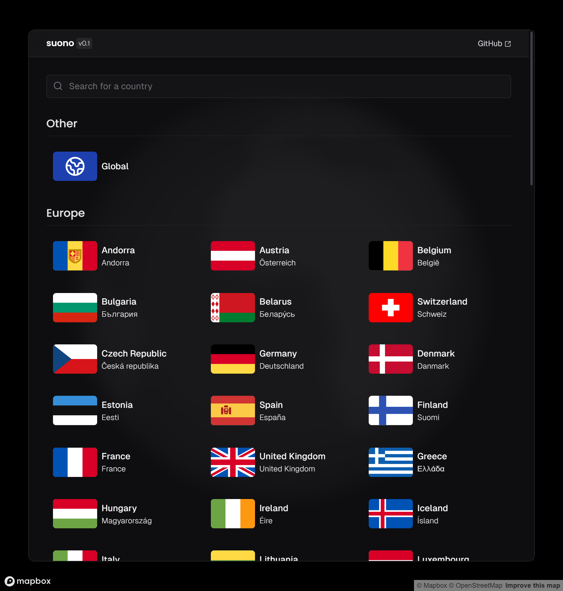

# suono 🌐

Jam around the world with Suono: Check out the coolest tracks from every country.

## Features

- Song audio previews
- Top 50 songs from each country
- Searching for countries using [fuse.js](https://www.fusejs.io/)
- Highlighting the selected country on the map in the background using [react-map-gl](https://visgl.github.io/react-map-gl/)
  
## Preview

<a aria-label="Similar Songs preview" href="https://similar-songs.itsbruno.dev/song/3gY6tiCNsuVi6s8kPV6aQg">
  
</a>

## Running Locally

### Prerequisites

#### Spotify
- Create an application on the [Spotify Developer](https://developer.spotify.com/dashboard/create) website.
- Copy the **client ID** and the **client secret** and add them to the environment file _(SPOTIFY_CLIENT_ID, SPOTIFY_CLIENT_SECRET)_.

#### Mapbox

- Copy your public token from [Mapbox](https://account.mapbox.com), and add it to the environment file _(NEXT_PUBLIC_MAPBOX_TOKEN)_.
- (Optional) Add a map style either from [Mapbox Classic styles](https://docs.mapbox.com/api/maps/styles/#classic-mapbox-styles) or from [Mapbox Studio](https://studio.mapbox.com) to the environment file _(NEXT_PUBLIC_MAPBOX_STYLE)_.
  - The default style is `mapbox://styles/mapbox/dark-v11`.

#### Last Steps

- Rename `.env.template` to `.env.local`, and you're good to go.
- (Optional) [pnpm package manager](https://pnpm.io)

### Running

> [!NOTE]  
> This project uses pnpm as the package manager, but other package managers can be used as well.

To run this project locally, first install the required packages

```bash
pnpm install
```

Then, run the project in the development environment

```bash
pnpm dev
```

If you want to run the project in the production environment

```bash
pnpm build
pnpm start
```

### License

[GNU General Public License v3.0](https://choosealicense.com/licenses/gpl-3.0/)

---

<a href="https://nextjs.org"></a>
<a href="https://tailwindcss.com"></a>
<a href="https://spotify.com"></a>
<a href="https://suono.itsbruno.dev"></a>
